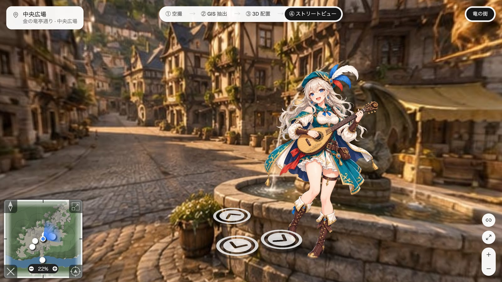

# VStreat

A Street View of a town that does not exist — and a pipeline for making your
own.



The town in that picture was not drawn from imagination. It was photographed
from above, traced into land cover, extruded into a massing model, and each
street painted from a render of that model taken from the camera's own eye.
That is why the arrows point where they say they point, why the minimap agrees
with the pictures, and why two views of the same street show the same houses.
The switcher along the top walks back through those four stages.

```sh
bun install
bun run dev
```

## Build your own town

**Read [AGENTS.md](AGENTS.md).** It is the whole method: the order of the
steps, the gate after each one, and what failing a gate means. Point a coding
agent at it, or follow it yourself.

A town is one directory:

```
worlds/<id>/
  world.json      how big the frame is, how high the hills are, where the light is
  aerial.prompt.txt
  town.geojson    the traced ground, in metres — you edit this by hand
  places.json     what places exist and where they stand
  scenes/         what each place looks like
```

`worlds/dragon/` is a complete working example of every one of those files.

Which image model paints it is your choice: the pipeline runs a command that
takes a prompt file and writes an image. See
[adapters/README.md](adapters/README.md). `adapters/mock.sh` runs the whole
chain for nothing so you can prove the plumbing before spending a generation.

## What it is built on

[Photo Sphere Viewer](https://photo-sphere-viewer.js.org/) 5.15 with its
virtual-tour and map plugins, React 19, Tailwind, Vite, Bun. The land-cover
trace is classical OpenCV — no model — so you can read it and argue with it.

Residents can answer in the dialogue window from a script, or from a local
[Ollama](https://ollama.com/) if one is running; Vite proxies `/ollama` in dev
and preview.

## Checks

```sh
bun run test        # invariants: links reciprocal, reachable, arrows apart, every prompt builds
bun run typecheck
bun run lint
bun run verify http://localhost:4173 shots dragon    # a real browser, end to end
```

`bun scripts/pano-gate.ts <url> out.jpg` is the check that actually decides
whether a panorama is a panorama: twelve frames around the sphere in one
sheet. The cheap numeric screen in `pano-check.ts` is necessary and not
sufficient — a flat landscape passes it.

## Sharing a view

`?w=<world>&n=<node>&y=<yaw>&p=<pitch>&z=<zoom>` opens at exactly that view,
and the address bar follows as you look around.

## Licences

This project is MIT — see [LICENSE](LICENSE).

Everything bundled for the browser is permissively licensed: MIT, ISC, Apache-2.0
and OFL-1.1 (the Geist font, whose files are embedded in the build). `THIRD-PARTY-LICENSES.txt` carries the
full notices and is regenerated with `bun run licenses`. Two copyleft packages
exist in the tree but never reach the browser: `sharp`'s libvips binary
(LGPL-3.0-or-later) and `lightningcss` (MPL-2.0, via Vite). Both are
build-time only.

The panoramas, the minimap artwork and the resident sprites under
`public/worlds/dragon/` are image-model output, generated by this pipeline.
Anything you generate is yours to license, subject to whatever your image
provider's terms say.
